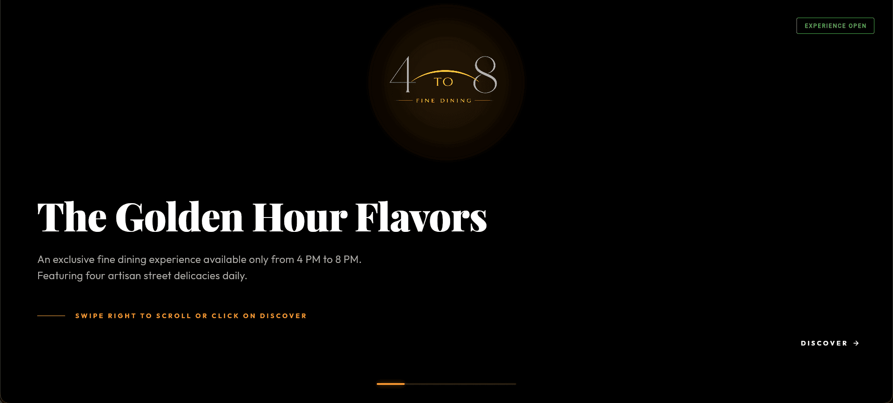
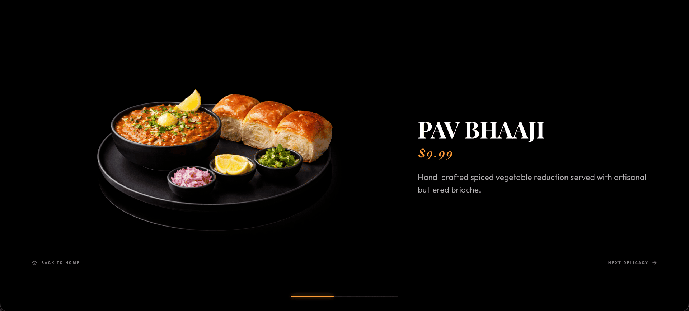
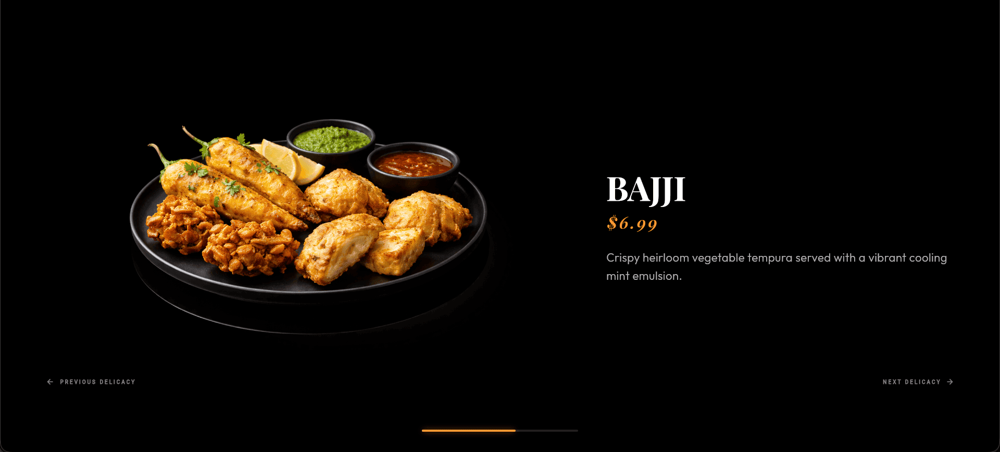
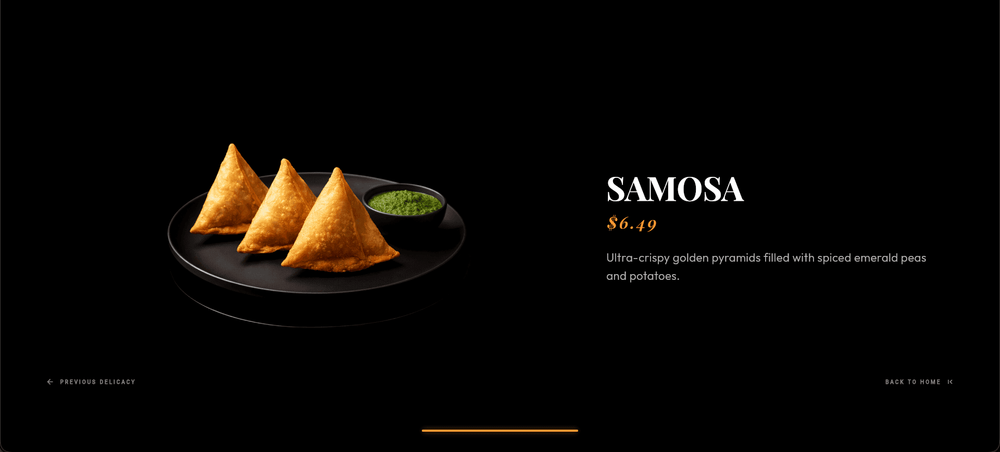
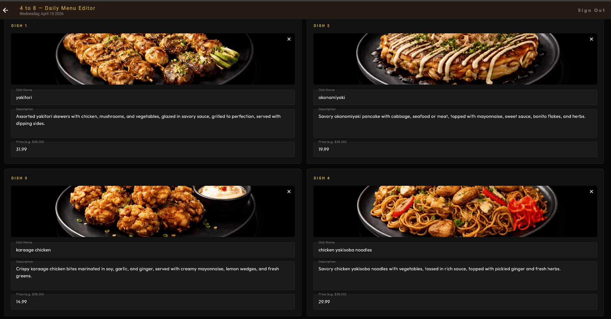

# 4 to 8: A Premium Fine-Dining Experience


A high-end, immersive digital menu designed for **"4 to 8"**, an exclusive eatery operational during the golden hours of 4 PM to 8 PM. This application leverages cutting-edge web technologies to deliver a cinematic fine-dining showcase with a live, day-specific menu driven by Google Cloud.

## ✨ Core Vision
The "4 to 8" website is an exercise in minimalist luxury. It focuses on large-scale, 4K food photography, elegant typography, and smooth, motion-driven navigation that mirrors the sophistication of a Michelin-star establishment. The menu updates daily — the admin panel lets staff publish each day's four dishes with imagery stored in GCS and menu data stored in Cloud Firestore.

## 📸 Visual Gallery
### Experience the Ambience


### Our Daily Delicacies
| PAV BHAAJI | BAJJI |
| :---: | :---: |
|  |  |

| KOZHUKATTAI | SAMOSA |
| :---: | :---: |
|  |  |

### Admin Control Center

*The administrative interface used by staff to curate and publish the day's exclusive menu.*

## 🚀 Key Features
- **Horizontal Parallax Engine:** A custom-built scrolling experience that creates deep visual layers between dish descriptions and 4K photography.
- **Optimized Render Engine:** `AnimatedBuilder` with targeted rebuilds ensures buttery-smooth 60fps+ performance during cinematic transitions; GCP clients are singletons reused across requests.
- **"Frisbee" Animation System:** Dynamic rotation and scaling effects that make delicacies fly into center stage as the user explores. Respects the OS-level reduced-motion preference (`MediaQuery.disableAnimations`).
- **Stitch-Audited Typography:** A world-class pairing of **Playfair Display** (High-Contrast Serif) and **Outfit** (Modern Geometric Sans) for an editorial, high-fashion aesthetic.
- **Inclusive Accessibility:** Full keyboard navigation (Left/Right Arrows), `Semantics` landmarks and labels throughout, Tooltip support, color-blind-safe status icons, and reduced-motion compliance.
- **Dynamic Operational Logic:** Real-time calculation of shop status ("EXPERIENCE OPEN" vs "RESERVATIONS AT 3 PM") based on the current time.
- **Live Daily Menu:** Today's four dishes are fetched from Firestore (`GET /api/menu`) at runtime — no rebuild required to update the menu. Falls back to local mock data if the network is unavailable.
- **Admin Panel:** Password-protected route (`/admin`) for uploading dish images to GCS and publishing the day's menu to Firestore.
- **Hardened Backend:** File type whitelist, 10 MB upload cap, path-traversal prevention, `imageUrl` domain validation, and timing-attack-safe secret comparison.

## 🛠 Tech Stack

| Layer | Technology |
| --- | --- |
| **Frontend** | [Flutter Web](https://flutter.dev/web) (CanvasKit renderer), `google_fonts ^8.0.2`, `http ^1.2.0`, `file_picker ^8.0.0`, `intl ^0.19.0` |
| **Backend API** | Python 3.12+, [FastAPI](https://fastapi.tiangolo.com/) `0.115.0`, Uvicorn `0.30.0`, Pydantic v2 |
| **Database** | Google Cloud Firestore (database ID: `[DATABASE_ID]`) |
| **Storage** | Google Cloud Storage (bucket: `[BUCKET_NAME]`) |
| **Server** | Nginx — serves Flutter static assets, proxies `/api/*` to FastAPI on `127.0.0.1:8000` |
| **Process manager** | Supervisord — manages both `nginx` and `uvicorn` in one container |
| **Deployment** | Google Cloud Run (single container, port 8080) |
| **Typography** | [Google Fonts](https://fonts.google.com/) — Playfair Display, Outfit |

## 🗂 Project Structure

```
flutter_stitch_app/
├── lib/
│   ├── main.dart          # App entry point, HorizontalEateryPage, routing
│   ├── theme.dart         # AppTheme — Playfair Display / Outfit design tokens
│   ├── config.dart        # AppConfig — API endpoint constants
│   ├── admin/
│   │   └── admin_page.dart   # Admin login + menu publishing UI (/admin)
│   ├── widgets/
│   │   ├── eatery_app_bar.dart           # Brand header with golden aura
│   │   ├── hero_section.dart             # Atmospheric entry view (Semantics landmark)
│   │   ├── indicators.dart               # Scroll, Hint (reduced-motion aware), and Status components
│   │   └── horizontal_parallax_item.dart # Parallax dish showcase with accessible nav buttons
│   └── data/
│       ├── firestore_service.dart  # HTTP client for /api/menu; shared dateKey() helper
│       ├── menu_service.dart       # MenuService — live fetch with mock fallback
│       └── mock_data.dart          # MenuItem model + offline fallback data
├── test/
│   ├── flutter/
│   │   ├── mock_data_test.dart     # MenuItem model & MockData unit tests (14 cases)
│   │   └── widgets_test.dart       # Flutter widget tests — HeroSection, TimeStatusIndicator
│   └── python/
│       ├── test_server.py          # FastAPI tests with mocked GCP — auth, validation, success (10 cases)
│       └── test_requirements.txt   # Python test dependencies
├── server.py              # FastAPI backend — singleton GCP clients, input validation, hardened upload
├── requirements.txt       # Python runtime dependencies
├── cors.json              # GCS CORS policy — origin-scoped, GET/HEAD only
├── nginx.conf             # Nginx config (port 8080, /api/* proxy)
├── supervisord.conf       # Runs nginx + uvicorn together
├── Dockerfile             # Multi-process container build
└── pubspec.yaml           # Flutter dependencies (sdk >=3.0.0 <4.0.0)
```

## 🔌 API Endpoints

| Method | Path | Auth | Description |
| --- | --- | --- | --- |
| `GET` | `/api/menu` | None | Returns today's dishes from Firestore |
| `POST` | `/api/upload-image` | `X-Admin-Secret` | Uploads a dish image to GCS (max 10 MB, images only) |
| `POST` | `/api/publish-menu` | `X-Admin-Secret` | Writes today's menu document to Firestore |

The backend uses **Application Default Credentials (ADC)** — on Cloud Run the attached service account is used automatically; locally, `gcloud auth application-default login` must be run first.

## 📦 Getting Started

### Prerequisites
- Flutter SDK `>=3.0.0 <4.0.0`
- Python 3.12+
- A GCP project with Firestore and Cloud Storage enabled
- `gcloud` CLI authenticated

### Local Development

1. **Clone the repository and enter the app directory:**
   ```bash
   cd flutter_stitch_app
   ```

2. **Configure environment variables.** Create a `.env` file with the following:

   | Variable | Description |
   | --- | --- |
   | `GCS_BUCKET` | GCS bucket name (e.g. `[BUCKET_NAME]`) |
   | `FIRESTORE_DB` | Firestore database ID (e.g. `[DATABASE_ID]`) |
   | `GCP_PROJECT` | GCP project ID |
   | `ADMIN_SECRET` | Secret header value for admin write operations |

   > **Security note:** Never commit `.env` to version control. Use a strong random string for `ADMIN_SECRET` in production (e.g. `python -c "import secrets; print(secrets.token_hex(32))"`).

3. **Authenticate with GCP for local ADC:**
   ```bash
   gcloud auth application-default login
   ```

4. **Install Python dependencies and start the API server:**
   ```bash
   python -m venv .venv && source .venv/bin/activate
   pip install -r requirements.txt
   uvicorn server:app --host 127.0.0.1 --port 8000 --reload
   ```

5. **Install Flutter dependencies and run the app:**
   ```bash
   flutter pub get
   flutter run -d chrome
   ```

### 🧪 Testing

The project includes an automated testing suite for both the frontend and backend. All 26 tests pass with no real GCP credentials required.

**Frontend Tests (16 cases — unit + widget):**
```bash
flutter test
```

**Backend Tests (10 cases — auth, input validation, success paths):**
```bash
# Install test dependencies
pip install -r test/python/test_requirements.txt
# Run from the app root with dummy env vars (no GCP needed)
GCS_BUCKET=test FIRESTORE_DB=test GCP_PROJECT=test ADMIN_SECRET=testsecret \
  pytest test/python/test_server.py -v
```

### Production Build

Build the optimized Flutter web assets before building the Docker image:
```bash
flutter build web --release
```

## ☁️ Cloud Deployment (GCP Cloud Run)
 
The container runs **both** the Nginx static file server and the FastAPI backend, managed by Supervisord.
 
1. **Build and Tag the Image** (using Cloud Build):
   Run this from the `flutter_stitch_app/` directory:
   ```bash
   gcloud builds submit --ignore-file .dockerignore --tag us-central1-docker.pkg.dev/[PROJECT_ID]/cloud-run-source-deploy/four2eightfinedine:v1 .
   ```
 
2. **Deploy to Cloud Run** with the required environment variables:
   ```bash
   gcloud run deploy eatery-web-app \
     --image us-central1-docker.pkg.dev/[PROJECT_ID]/cloud-run-source-deploy/four2eightfinedine:v1 \
     --platform managed \
     --region us-central1 \
     --allow-unauthenticated \
     --set-env-vars GCS_BUCKET=[BUCKET_NAME],FIRESTORE_DB=[DATABASE_ID],GCP_PROJECT=[PROJECT_ID],ADMIN_SECRET=[STRONG_SECRET]
   ```
 
   > **Note on Asset Handling:** Ensure your `.dockerignore` and `.gcloudignore` files use root-relative paths (e.g., `/assets/`) to prevent accidentally excluding the compiled assets in `build/web/assets/`.

   > The Cloud Run service account must have `roles/datastore.user` (Firestore) and `roles/storage.objectAdmin` (GCS) IAM permissions.

## 🔒 Security & Performance

- **Admin auth:** All write endpoints require an `X-Admin-Secret` header verified with `secrets.compare_digest` to prevent timing-attack side channels.
- **Upload hardening:** File content type and extension are both validated against an allowlist (`jpeg`, `png`, `webp`, `gif`). Files over 10 MB are rejected (HTTP 413). The `dish_folder` parameter is validated with a strict regex to prevent path traversal.
- **Firestore data integrity:** `imageUrl` values are validated by Pydantic to ensure they come from `storage.googleapis.com` or `firebasestorage.googleapis.com` only, preventing SSRF via arbitrary URLs.
- **GCS CORS:** Restricted to the app's own origins with GET/HEAD methods only — no wildcard origins.
- **UTC date keys:** `_date_key()` uses `timezone.utc` to avoid midnight ambiguity in non-UTC deployments.
- **GCP client singletons:** Firestore and GCS clients are created once per process, avoiding repeated credential loading and connection overhead on every request.
- **Security headers (Nginx):** `X-Frame-Options: SAMEORIGIN`, `X-Content-Type-Options: nosniff`, `X-XSS-Protection`, `Referrer-Policy`, and a `Content-Security-Policy` whitelisting Google Fonts and the GCS bucket.
- **Credentials:** The backend uses ADC — no service account key files are embedded in the image.
- **Asset caching:** Static assets (JS, CSS, images, fonts) cached for 30 days with `Cache-Control: public`.

---
*Created with focus on high-fidelity aesthetics and performance.*
